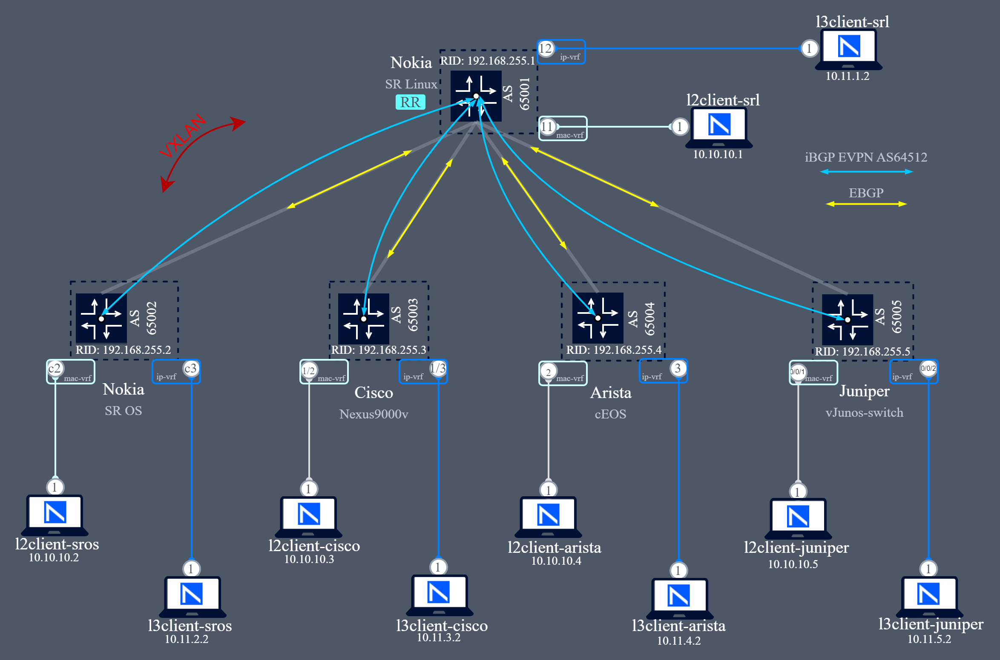

# Multi-Vendor Containerlab Topology for EVPN VXLAN Interoperability and Testing

This **Containerlab** topology is designed to simulate a **multi-vendor** networking environment featuring devices from **Nokia, Cisco, Arista, and Juniper**. The primary goals of this lab are **EVPN VXLAN** interoperability and **CLI exploration** across different vendors:



 

1. **EVPN VXLAN Interoperability**
	- Validate **BGP EVPN** control plane functionality across vendors.
	- Test **VXLAN** data plane encapsulation/decapsulation between different implementations.

2. **Configuration Testing & CLI Exploration**
	- Use the lab as a sandbox to practice vendor-specific CLI commands.
	- Compare **configuration styles and best practices** across Nokia SR Linux/SR OS, Cisco NX-OS, Arista EOS, and Juniper Junos.
	- Test **network automation** workflows for provisioning and migration scenarios 🚀

## Deploying the lab
Before deploying the lab we need to have the Network Operating System images ready.
For Nokia SR Linux we simply pull it: 
```bash
# SR Linux: pull SR linux 24.10.2
docker pull ghcr.io/nokia/srlinux:24.10.2
```
For Arista cEOS you can download the image from [software downloads](https://www.arista.com/en/support/software-download) and import the archive with docker:
```bash
# import container image and save it under ceos:4.33.1F
docker import cEOS64-lab-4.33.1F.tar.xz ceos:4.33.1F
```
The rest of the images need to be created using [vrnetlab](https://github.com/hellt/vrnetlab):
```bash
# Nokia SR OS
https://github.com/hellt/vrnetlab/tree/master/sros
# Cisco Nexus 9000v
https://github.com/hellt/vrnetlab/tree/master/n9kv
# Juniper vJunos-switch
https://github.com/hellt/vrnetlab/tree/master/vjunosswitch
```
Once we have the images ready we can deploy the lab:
```bash
# clone repo
git clone https://github.com/michelredondo/too-many-CLIs-lab.git
cd too-many-CLIs-lab
# deploy lab with containerlab
containerlab deploy
```
It takes ~7min for the lab to be operational

## Verification
We use eBGP to exchange ipv4 prefixes and iBGP for the EVPN IMET and MAC/IP routes:
```bash
A:srl# show network-instance default protocols bgp neighbor
---------------------------------------------------------------------------------------------------------------------------------------------------------------------------------
BGP neighbor summary for network-instance "default"
Flags: S static, D dynamic, L discovered by LLDP, B BFD enabled, - disabled, * slow
---------------------------------------------------------------------------------------------------------------------------------------------------------------------------------
---------------------------------------------------------------------------------------------------------------------------------------------------------------------------------
+-------------------+----------------------------+-------------------+-------+----------+----------------+----------------+--------------+----------------------------+
|     Net-Inst      |            Peer            |       Group       | Flags | Peer-AS  |     State      |     Uptime     |   AFI/SAFI   |       [Rx/Active/Tx]       |
+===================+============================+===================+=======+==========+================+================+==============+============================+
| default           | 192.168.1.1                | underlay          | S     | 65002    | established    | 0d:13h:24m:43s | ipv4-unicast | [2/1/8]                    |
| default           | 192.168.1.3                | underlay          | S     | 65003    | established    | 0d:13h:18m:14s | ipv4-unicast | [2/1/8]                    |
| default           | 192.168.1.5                | underlay          | S     | 65004    | established    | 0d:13h:27m:55s | ipv4-unicast | [2/1/8]                    |
| default           | 192.168.1.7                | underlay          | S     | 65005    | established    | 0d:13h:25m:58s | ipv4-unicast | [2/1/8]                    |
| default           | 192.168.255.2              | overlay           | S     | 64512    | established    | 0d:13h:23m:43s | evpn         | [2/2/8]                    |
| default           | 192.168.255.3              | overlay           | S     | 64512    | established    | 0d:13h:18m:1s  | evpn         | [2/2/8]                    |
| default           | 192.168.255.4              | overlay           | S     | 64512    | established    | 0d:13h:27m:49s | evpn         | [2/2/8]                    |
| default           | 192.168.255.5              | overlay           | S     | 64512    | established    | 0d:13h:25m:53s | evpn         | [2/2/8]                    |
+-------------------+----------------------------+-------------------+-------+----------+----------------+----------------+--------------+----------------------------+
---------------------------------------------------------------------------------------------------------------------------------------------------------------------------------
Summary:
8 configured neighbors, 8 configured sessions are established, 0 disabled peers
0 dynamic peers

--{ running }--[  ]--
```
We can also test the overlay connectivity by connecting to the different simulated clients:
```bash
docker exec -it clab-polyglot-cli-srl bash

[*]─[cli-srl]─[/]
└──> ping 10.10.10.2
PING 10.10.10.2 (10.10.10.2) 56(84) bytes of data.
64 bytes from 10.10.10.2: icmp_seq=1 ttl=64 time=2.13 ms
^C
--- 10.10.10.2 ping statistics ---
1 packets transmitted, 1 received, 0% packet loss, time 0ms
rtt min/avg/max/mdev = 2.128/2.128/2.128/0.000 ms

[*]─[cli-srl]─[/]
```
